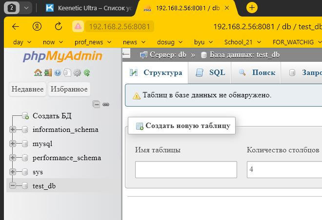
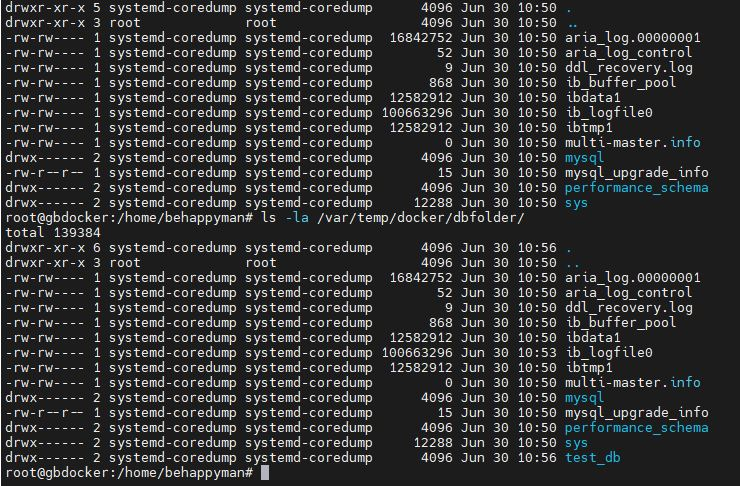

### разворачиваем контейнер с mariadb

behappyman@gbdocker:~$ sudo docker run --name MariaDB -e MARIADB_ROOT_PASSWORD=test123 -d mariadb:10.10.2

### разворачиваем контейнер с phpmyadmin и линкуем (связываем по сети) его с контейнером с mariadb

behappyman@gbdocker:~$ sudo docker run --name PHPMYADMIN -d --link MariaDB:db -p 8081:80 phpmyadmin/phpmyadmin

### разворачиваем контейнер с mariadb при этом подмонтируем папку на хостовой машине к папке контейнера, содержащей файлы БД

root@gbdocker:/home/behappyman# docker run --name MariaDB -e MARIADB_ROOT_PASSWORD=test123 -v /var/temp/docker/dbfolder:/var/lib/mysql -d mariadb:10.10.2

