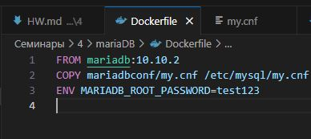
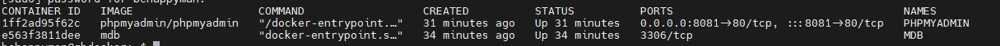
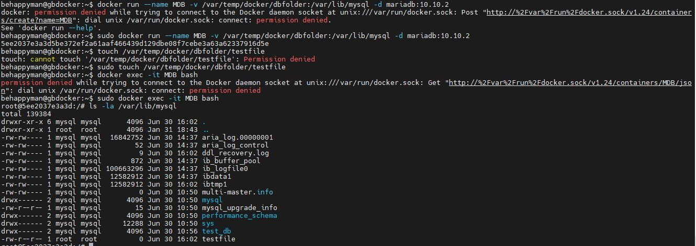
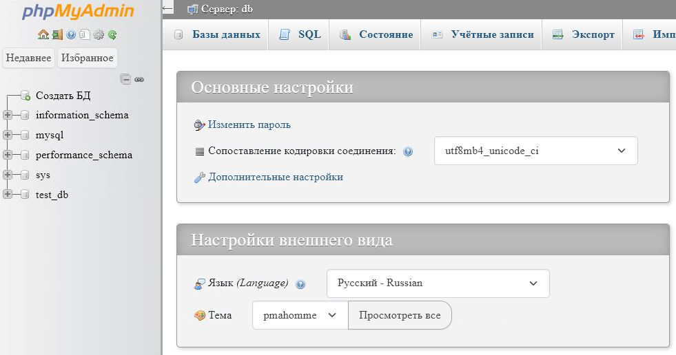

- Сбилдить свой имейдж на основе имейджа mariaDB используя Dockerfile. Можете еще в Dockerfile добавить функционал по уменьшению веса образа к примеру.

- Сделать свой конфиг для mariaDB и заменить конфиг базового имейджа используя Dockerfile. Допустим поменять порт, максимальное использованеи памяти и т.д.

- Слинковать папку с базой данных с контейнера с mariaDB в папку на хосте (как на семинаре). Заполнить БД данными или добавить запись и проверить, что файлы базы данных появились на хостовой машине

- Запустить phpmyadmin (в контейнере) и через веб проверить, что все введенные данные доступны.

