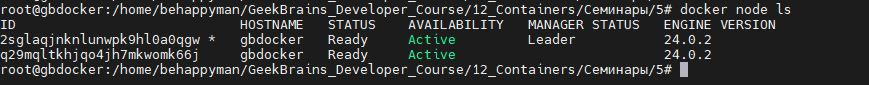

1) создать docker compose файл, состоящий из 2 различных контейнеров: 1 - веб, 2 - БД

docker-compose.yml

2) запустить docker compose файл

3) по итогу на БД контейнере должно быть 2 реплики, на админере должна быть 1 реплика. Всего должно получиться 3 контейнера

4) выводы зафиксировать

Задание 2*:

1) создать кластер и мастер и слейв ноды

root@gbdocker:/home/behappyman/GeekBrains_Developer_Course/12_Containers/Семинары/5# docker swarm init

root@gbdocker:/home/behappyman/GeekBrains_Developer_Course/12_Containers/Семинары/5#  docker swarm join --token SWMTKN-1-1arsxpzf3050qjgvecdai9at5dsz56hcv056nd0i4v5f8nv9uv-1xk82nbypk993tydolmxi9xmz 192.168.2.56:2377

This node joined a swarm as a worker.

2) задеплоить на ноду несколько экземляров какого-нибудь 
контейнера, например nginx

root@gbdocker:/home/behappyman/GeekBrains_Developer_Course/12_Containers/Семинары/5# docker service create --name nginx --label node2 --replicas 4 nginx-alpine;

